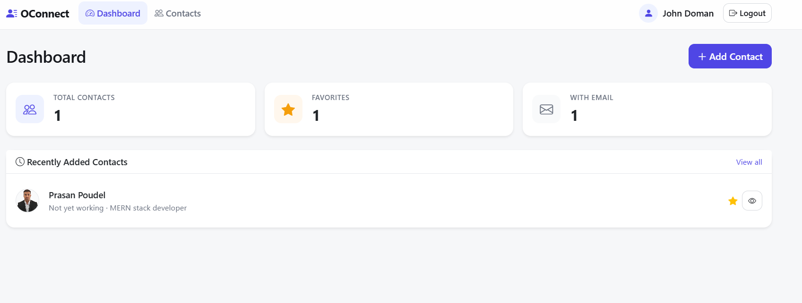
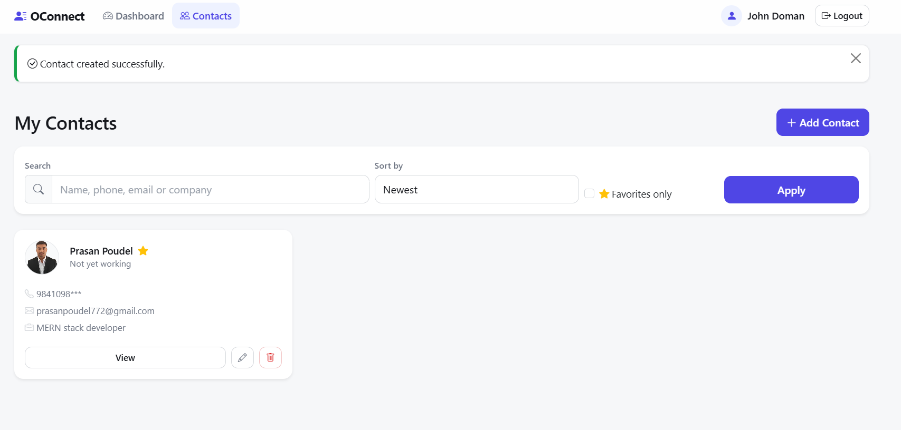

# OConnect — Contact Record Management System

A clean, production-ready **Contact Record Management System** built with **Node.js**, **Express.js**, **MongoDB (Mongoose)**, **EJS**, **Bootstrap 5**, **Express Session**, **bcrypt**, **Multer**, **Cloudinary**, **Express Validator**, and **Helmet/CSRF** protection. No frontend framework is used — the UI is server-rendered with reusable EJS partials following the MVC architecture.

## Screenshots

### Dashboard



### Contacts



## Features

- **Authentication**
  - User registration & login/logout
  - Session-based authentication (secure, httpOnly cookies)
  - Password hashing with **bcrypt**
  - Protected routes (per-user data isolation)
- **Contact CRUD**
  - Create, read, update, delete contacts
  - Profile picture upload (stored in **Cloudinary** under `Contacts_Record`)
  - Image preview before upload
  - Old Cloudinary image removed on update / delete
- **Search, filter & sort**
  - Search by name, phone, email, or company
  - Filter favorites only
  - Sort by name (A–Z / Z–A) and newest / oldest
  - Pagination (10 contacts per page)
- **Dashboard** with total contacts, favorite contacts, and recently added contacts
- **UX**: flash success/error messages, delete confirmation, responsive Bootstrap 5 UI, custom 404 page
- **Security**: Helmet, CSRF protection, XSS-safe output, secure sessions, centralized error handling

## Contact fields

Full Name (required), Phone, Email, Address, Company, Job Title, Website, Notes, Favorite (Yes/No), Created At, Updated At.

## Project Structure

```
.
├── app.js                  # App entry point & middleware wiring
├── config/
│   ├── db.js               # MongoDB connection
│   └── cloudinary.js       # Cloudinary configuration
├── controllers/
│   ├── authController.js
│   ├── contactController.js
│   └── dashboardController.js
├── middleware/
│   ├── auth.js             # isAuthenticated guard
│   ├── upload.js           # Multer config (in-memory)
│   └── errorHandler.js     # 404 + centralized error handler
├── models/
│   ├── User.js
│   └── Contact.js
├── public/
│   ├── css/styles.css
│   ├── js/main.js
│   └── img/default-avatar.svg
├── routes/
│   ├── authRoutes.js
│   ├── contactRoutes.js
│   └── dashboardRoutes.js
├── utils/
│   └── cloudinary.js       # upload / delete helpers
├── views/
│   ├── partials/           # head, header, footer, flash
│   ├── auth/               # login, register
│   ├── contacts/           # index, form, show
│   ├── dashboard/
│   └── error/              # 404, error
├── .env.example
└── README.md
```

## Prerequisites

- Node.js (v18+)
- MongoDB (local instance or MongoDB Atlas)
- A Cloudinary account

## Installation

1. Clone the repository and install dependencies:

   ```bash
   npm install
   ```

2. Copy `.env.example` to `.env` and fill in your values:

   ```bash
   cp .env.example .env
   ```

   | Variable | Description |
   | --- | --- |
   | `PORT` | Server port (default `3000`) |
   | `SESSION_SECRET` | Long random string for session signing |
   | `MONGODB_URI` | MongoDB connection string |
   | `CLOUDINARY_CLOUD_NAME` | Cloudinary cloud name |
   | `CLOUDINARY_API_KEY` | Cloudinary API key |
   | `CLOUDINARY_API_SECRET` | Cloudinary API secret |
   | `CLOUDINARY_FOLDER` | Cloudinary folder (`Contacts_Record`) |

3. Start the application:

   ```bash
   # production
   npm start

   # development (with auto-reload)
   npm run dev
   ```

4. Open <http://localhost:3000> in your browser.

## Scripts

| Command | Description |
| --- | --- |
| `npm start` | Start the server |
| `npm run dev` | Start with `nodemon` (auto-restart) |
| `npm run lint` | Run ESLint |

## Notes

- Images are streamed from memory straight to Cloudinary (no local disk writes).
- When a contact image is replaced or the contact is deleted, the previous image is removed from Cloudinary automatically.
- Contacts are always scoped to the authenticated user (`user` field on the `Contact` model).
- For production, set `NODE_ENV=production` so session cookies are flagged `secure`.


## License

MIT
